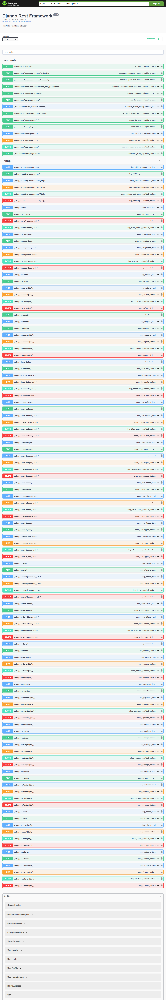

## you can use it where you need 2 type of user. ( superuser and visitor)




### Getting Started

1. Clone this project using the following command:
```bash
git clone https://github.com/Afzal20/DRF-Ecommerce.git
```

or 

```bash
git clone https://github.com/Afzal20/DRF-Ecommerce/tree/dummy-data-models
```

2. dump data from .sqlite3 file sing the following command:
```bash  
python manage.py dumpdata --natural-primary --natural-foreign --indent 4 > data.json
```

3. If you want to load data to you own database server like postgresql server
```bash 
python manage.py loaddata data.json
```

