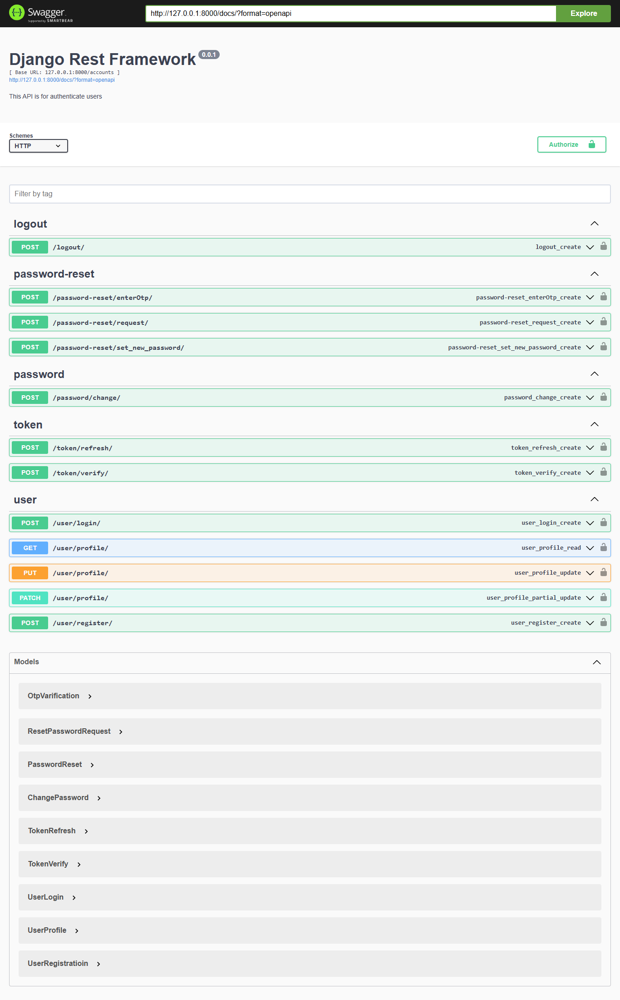

# DRF E-commerce

A comprehensive Django REST Framework-based e-commerce application that supports two types of users: **superuser** (admin) and **visitor** (customer).



## Features

- **Dual User System**: Supports both superuser (admin) and visitor (customer) accounts
- **Product Management**: Complete product catalog with categories, images, and reviews
- **Shopping Cart**: Add/remove products and manage cart items
- **Order Processing**: Full order management system with payment tracking
- **Admin Interface**: Enhanced Django admin with custom theming
- **API Endpoints**: RESTful API for all e-commerce operations

## Getting Started

### 1. Clone the Repository

Choose one of the following options:

**Main branch:**
```bash
git clone https://github.com/Afzal20/DRF-Ecommerce.git
```

**Dummy data branch:**
```bash
git clone https://github.com/Afzal20/DRF-Ecommerce.git -b dummy-data-models
```

### 2. Navigate to Project Directory
```bash
cd DRF-Ecommerce
```

### 3. Install Dependencies
```bash
pip install -r requirements.txt
```

### 4. Database Setup

#### Option A: Using SQLite (Default)
```bash
python manage.py migrate
```

#### Option B: Export Data from Existing SQLite Database
If you have an existing `.sqlite3` file and want to export the data:
```bash
python manage.py dumpdata --natural-primary --natural-foreign --indent 4 > data.json
```

#### Option C: Using PostgreSQL or Other Database
1. Configure your database settings in `settings.py`
2. Run migrations:
   ```bash
   python manage.py migrate
   ```
3. Load the exported data:
   ```bash
   python manage.py loaddata data.json
   ```

### 5. Load Admin Theme (Optional)
To apply the custom admin interface theme:
```bash
python manage.py loaddata admin_interface_theme_custom.json
```

### 6. Create Superuser
```bash
python manage.py createsuperuser
```

### 7. Run the Development Server
```bash
python manage.py runserver
```

## Usage

### User Types

1. **Superuser (Admin)**
   - Access to Django admin panel
   - Manage products, categories, orders
   - View analytics and reports
   - User management

2. **Visitor (Customer)**
   - Browse products and categories
   - Add items to cart
   - Place orders
   - Leave product reviews

### API Endpoints

The application provides RESTful API endpoints for:
- Product management
- Cart operations
- Order processing
- User authentication
- Category browsing

## Important Notes

⚠️ **Image Assets**: The repository does not include the complete image directory due to size constraints (200MB+). You may need to:
- Add your own product images
- Update image paths in the database
- Configure media file handling for production

## Database Migration

When switching between different database systems (SQLite → PostgreSQL, etc.):
1. Export data using `dumpdata`
2. Configure new database settings
3. Run `migrate` to create tables
4. Import data using `loaddata`

## Contributing

1. Fork the repository
2. Create your feature branch (`git checkout -b feature/AmazingFeature`)
3. Commit your changes (`git commit -m 'Add some AmazingFeature'`)
4. Push to the branch (`git push origin feature/AmazingFeature`)
5. Open a Pull Request

## License

This project is licensed under the MIT License - see the [LICENSE](LICENSE) file for details.

## Support

For support and questions, please open an issue in the GitHub repository.


# E-commerce API Documentation

## Base URL
```
http://localhost:8000/api/
```

## Authentication
The API supports multiple authentication methods:
- Session Authentication (for web interface)
- Token Authentication
- Basic Authentication

## Content Type
All requests should include:
```
Content-Type: application/json
```

---

## Endpoints Overview

### 1. Products API
**Endpoint:** `/api/products/`

#### GET /api/products/
Retrieve a list of all products.

**Response Example:**
```json
{
  "count": 150,
  "next": "http://localhost:8000/api/products/?page=2",
  "previous": null,
  "results": [
    {
      "id": 1,
      "title": "iPhone 15 Pro",
      "description": "Latest iPhone with advanced features",
      "category": 2,
      "price": "999.99",
      "discount_percentage": "10.00",
      "rating": "4.50",
      "stock": 25,
      "brand": "Apple",
      "sku": "IPH15PRO001",
      "weight": "0.20",
      "width": "7.09",
      "height": "14.67",
      "depth": "0.83",
      "warranty_information": "1 year warranty",
      "shipping_information": "Free shipping",
      "availability_status": "In Stock",
      "return_policy": "30 days return",
      "minimum_order_quantity": 1,
      "created_at": "2024-01-15T10:30:00Z",
      "updated_at": "2024-01-15T10:30:00Z",
      "barcode": "123456789012",
      "thumbnail": "http://localhost:8000/media/products/thumbnails/iphone15.jpg"
    }
  ]
}
```

#### POST /api/products/
Create a new product (Admin only).

**Request Body:**
```json
{
  "title": "Samsung Galaxy S24",
  "description": "Latest Samsung smartphone",
  "category": 2,
  "price": "899.99",
  "discount_percentage": "5.00",
  "rating": "4.30",
  "stock": 30,
  "brand": "Samsung",
  "sku": "SAMS24001",
  "weight": "0.18",
  "width": "7.01",
  "height": "14.61",
  "depth": "0.79",
  "warranty_information": "2 years warranty",
  "shipping_information": "Free shipping",
  "availability_status": "In Stock",
  "return_policy": "30 days return",
  "minimum_order_quantity": 1,
  "barcode": "987654321098"
}
```

#### GET /api/products/{id}/
Retrieve a specific product by ID.

#### PUT /api/products/{id}/
Update a specific product (Admin only).

#### DELETE /api/products/{id}/
Delete a specific product (Admin only).

---

### 2. Categories API
**Endpoint:** `/api/categories/`

#### GET /api/categories/
Retrieve all product categories.

**Response Example:**
```json
[
  {
    "id": 1,
    "name": "Electronics",
    "slug": "electronics",
    "description": "Electronic devices and accessories",
    "image": "http://localhost:8000/media/categories/electronics.jpg",
    "sort_order": 1,
    "meta_title": "Electronics | E-commerce Store",
    "meta_description": "Browse our wide selection of electronic devices",
    "is_active": true,
    "product_count": 45
  }
]
```

#### POST /api/categories/
Create a new category (Admin only).

---

### 3. Cart API
**Endpoint:** `/api/cart/`

#### GET /api/cart/
Retrieve current user's cart.

**Response Example:**
```json
{
  "id": 1,
  "user": 1,
  "products": [1, 3, 5],
  "updated": "2024-01-15T14:30:00Z",
  "active": true,
  "total": "1899.97"
}
```

#### POST /api/cart/add/
Add product to cart.

**Request Body:**
```json
{
  "product_id": 1,
  "quantity": 2
}
```

#### DELETE /api/cart/remove/{product_id}/
Remove product from cart.

---

### 4. Orders API
**Endpoint:** `/api/orders/`

#### GET /api/orders/
Retrieve user's order history.

**Response Example:**
```json
[
  {
    "id": 1,
    "user": 1,
    "first_name": "John",
    "last_name": "Doe",
    "phone_number": "+1234567890",
    "district": "New York",
    "upozila": "Manhattan",
    "city": "New York",
    "address": "123 Main Street, Apt 4B",
    "payment_method": "Credit Card",
    "phone_number_payment": "+1234567890",
    "transaction_id": "TXN123456789",
    "created_at": "2024-01-15T12:00:00Z",
    "updated_at": "2024-01-15T12:00:00Z",
    "ordered": true,
    "total_price": "1979.97",
    "order_items": [
      {
        "id": 1,
        "product": "iPhone 15 Pro",
        "quantity": 2,
        "price": "999.99",
        "color": "Space Black",
        "size": "128GB",
        "total_price": "1999.98"
      }
    ]
  }
]
```

#### POST /api/orders/
Create a new order.

**Request Body:**
```json
{
  "first_name": "John",
  "last_name": "Doe",
  "phone_number": "+1234567890",
  "district": "New York",
  "upozila": "Manhattan", 
  "city": "New York",
  "address": "123 Main Street, Apt 4B",
  "payment_method": "Credit Card",
  "phone_number_payment": "+1234567890",
  "order_items": [
    {
      "product": "iPhone 15 Pro",
      "quantity": 2,
      "price": "999.99",
      "color": "Space Black",
      "size": "128GB"
    }
  ]
}
```

---

### 5. Product Reviews API
**Endpoint:** `/api/reviews/`

#### GET /api/reviews/
Get all product reviews.

#### GET /api/reviews/?product={product_id}
Get reviews for a specific product.

**Response Example:**
```json
[
  {
    "id": 1,
    "product": 1,
    "rating": 5,
    "comment": "Excellent product! Highly recommended.",
    "date": "2024-01-15T16:45:00Z",
    "reviewer_name": "Alice Smith",
    "reviewer_email": "alice@example.com"
  }
]
```

#### POST /api/reviews/
Add a new product review.

**Request Body:**
```json
{
  "product": 1,
  "rating": 5,
  "comment": "Great product!",
  "reviewer_name": "John Doe",
  "reviewer_email": "john@example.com"
}
```

---

### 6. Districts API
**Endpoint:** `/api/districts/`

#### GET /api/districts/
Get all available districts for shipping.

**Response Example:**
```json
[
  {
    "id": 1,
    "title": "Dhaka"
  },
  {
    "id": 2,
    "title": "Chittagong"
  }
]
```

---

### 7. Coupons API
**Endpoint:** `/api/coupons/`

#### POST /api/coupons/validate/
Validate a coupon code.

**Request Body:**
```json
{
  "code": "SAVE10"
}
```

**Response:**
```json
{
  "valid": true,
  "discount": 10.0,
  "message": "Coupon applied successfully"
}
```

---

### 8. Contact Messages API
**Endpoint:** `/api/contact/`

#### POST /api/contact/
Submit a contact form message.

**Request Body:**
```json
{
  "email": "customer@example.com",
  "subject": "Product Inquiry",
  "details": "I have a question about the iPhone 15 Pro..."
}
```

---

### 9. Hero Section API
**Endpoint:** `/api/hero-sections/`

#### GET /api/hero-sections/
Get hero section content for homepage.

**Response Example:**
```json
[
  {
    "id": 1,
    "title": "Summer Sale 2024",
    "offer": "Up to 50% Off",
    "button_1_Text": "Shop Now",
    "button_1_navigate_url": "/products/",
    "button_2_Text": "Learn More",
    "button_2_navigate_url": "/about/",
    "image": "http://localhost:8000/media/HeroSection/summer_sale.jpg"
  }
]
```

---

### 10. Top Selling Products API
**Endpoint:** `/api/top-selling/`

#### GET /api/top-selling/
Get list of top selling products.

**Response Example:**
```json
[
  {
    "id": 1,
    "product": {
      "id": 1,
      "title": "iPhone 15 Pro",
      "price": "999.99",
      "discount_percentage": "10.00",
      "thumbnail": "http://localhost:8000/media/products/thumbnails/iphone15.jpg"
    },
    "discounted_price": "899.99",
    "is_available": true,
    "savings_amount": "100.00"
  }
]
```

---

## Error Responses

### Common Error Codes
- `400 Bad Request` - Invalid request data
- `401 Unauthorized` - Authentication required
- `403 Forbidden` - Permission denied
- `404 Not Found` - Resource not found
- `500 Internal Server Error` - Server error

### Error Response Format
```json
{
  "error": "Error message",
  "details": {
    "field_name": ["Error description"]
  }
}
```

---

## Rate Limiting
- **Authenticated users**: 1000 requests per hour
- **Anonymous users**: 100 requests per hour

---

## Pagination
List endpoints support pagination with the following parameters:
- `page`: Page number (default: 1)
- `page_size`: Items per page (default: 20, max: 100)

**Example:**
```
GET /api/products/?page=2&page_size=50
```

---

## Filtering and Search
Many endpoints support filtering and search:

### Products
- `search`: Search in title and description
- `category`: Filter by category ID
- `price_min`: Minimum price
- `price_max`: Maximum price
- `in_stock`: Filter available products

**Example:**
```
GET /api/products/?search=iphone&category=2&price_min=500&price_max=1500&in_stock=true
```

---

## Webhooks
The API can send webhooks for certain events:
- Order created
- Payment processed
- Product low stock alert

Configure webhook URLs in the admin panel.