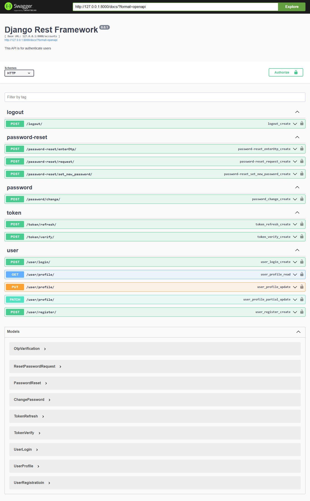

## you can use it where you need 2 type of user. ( superuser and visitor)




### Getting Started

1. Clone this project using the following command:
    ```bash
    git clone https://github.com/Afzal20/DRF_AUTH_with_Cookies.git
    ```

2. Add your app to the `INSTALLED_APPS` list in the `settings.py` file:
    ```python
    INSTALLED_APPS = [
         ...,
         'your_app_name',
    ]
    ```

3. Update the email backend in the `settings.py` file:
    ```python
    EMAIL_BACKEND = 'django.core.mail.backends.console.EmailBackend'
    ```

4. Update other email-related settings in the `settings.py` file as needed:
    ```python
    EMAIL_HOST = 'your_email_host'
    EMAIL_PORT = your_email_port
    EMAIL_USE_TLS = True  # or False, depending on your setup
    EMAIL_HOST_USER = 'your_email_username'
    EMAIL_HOST_PASSWORD = 'your_email_password'
    DEFAULT_FROM_EMAIL = 'your_default_from_email'
    ```
    Replace the placeholders with the appropriate values for your email service provider.
## Recent Changes
- Pinned dependencies and split requirements into base/dev/test (Phase 0 Step 1)
- Added pre-commit (ruff, black, isort) and fixed lint baseline (Phase 0 Step 2)
- Introduced pytest + factory_boy scaffolding with first smoke tests (Phase 0 Step 3)
