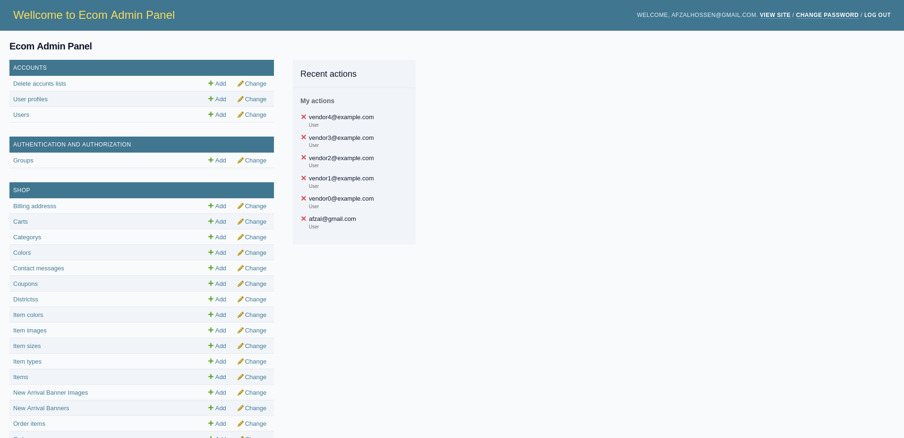
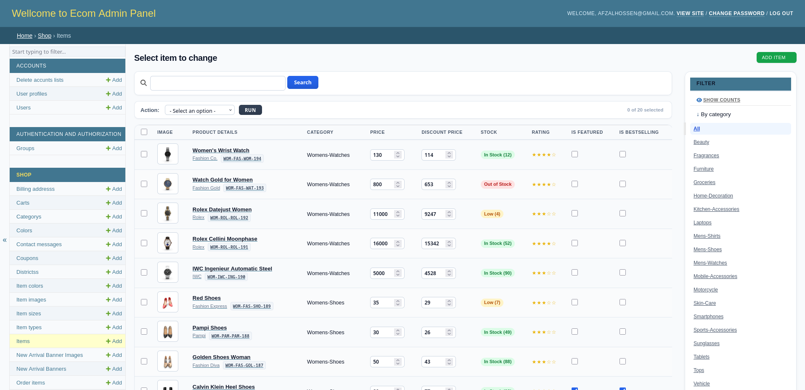
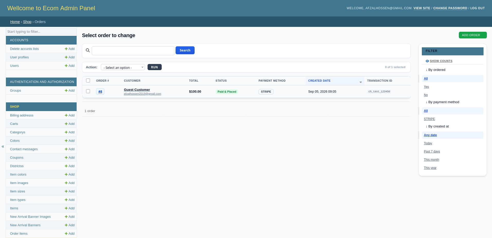
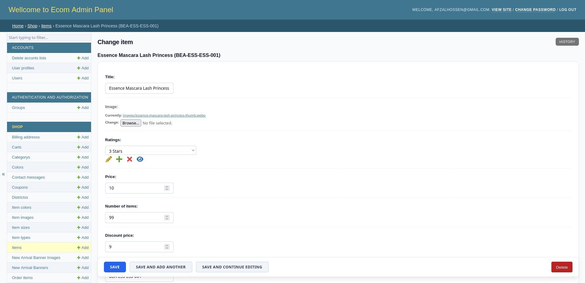
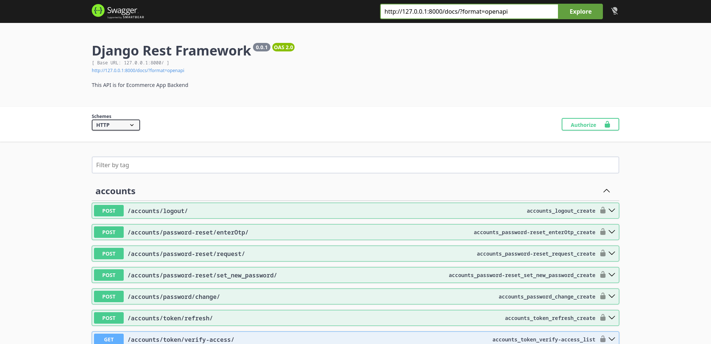

# DRF-Ecommerce

A production-ready Django REST Framework e-commerce backend featuring **cookie-based JWT authentication** (including Google Sign-In), **Stripe Checkout** payments, **real-time AI Shopping Assistant** (Django Channels + OpenRouter streaming), and an **easy-to-use, pure light theme administrative back-office**. Designed to pair seamlessly with a modern Next.js / React storefront.

---

## Administration and API Visual Showcase

The backend includes a redesigned, modern light-theme back-office interface and interactive Swagger API documentation.

### 1. Administrative Home Dashboard

*Central back-office navigation hub with pure light theme styling, clear application modules, and recent activity audit logs.*

### 2. Product Catalog and Inventory Management

*High-efficiency catalog manager featuring 44x44 product image thumbnails, brand names, monospace SKU badges, dynamic stock status pills (In Stock, Low Stock, Out of Stock), star ratings, inline editable pricing controls, and sidebar category filters.*

### 3. Order Management and Payment Auditing

*Real-time orders changelist displaying monospace order identifiers, customer name and email, formatted dollar totals, payment status badges (Paid & Placed vs. Pending), payment method pills, transaction codes, and date filters.*

### 4. Product Details and Variant Editor

*Streamlined changeform interface with card fieldsets, rounded inputs with focus rings, inline image galleries, sizes, colors, and a sticky bottom action bar for rapid saving.*

### 5. Interactive Swagger and OpenAPI Documentation

*Interactive REST API documentation generated via Swagger UI at `/docs/`, enabling live testing and exploration of all Accounts, Shop, Order, AI, and Store Configuration endpoints.*

---

## Features

- **Authentication (httpOnly cookies)**
  - Email/password registration & login — JWT access/refresh tokens stored in secure cookies
  - Google Sign-In (`POST /accounts/user/google-login/` with an `id_token`)
  - JWT rotation & blacklist, short-lived access tokens
  - Email OTP flow for password reset (hashed OTP storage, single-use, constant-time verification)
  - Logout (cookie + token blacklist), token refresh/verify, password change, user profile
  - Scoped rate throttling for auth, OTP, and anonymous browsing
- **Shop & Catalog Management**
  - Items with images, sizes, colors, variants, ratings, and multi-vendor support
  - Dynamic promotional banners (`NewArrivalBanner`, `NewArrivalBannerImage`) with multi-image support
  - Dynamic site settings (`SiteSetting`) for hotline phone number, labels, and announcement banners
  - Categories, item types, districts, sliders, hero sections, coupons, refunds, contact messages
  - Per-user cart (create / list / update quantity / delete line items)
  - Orders & order items; Stripe Checkout session creation
  - Stripe webhook handler that marks orders paid and records payments
- **Real-Time AI Shopping Assistant (WebSockets)**
  - Streaming conversational shopping assistant over WebSockets (`/ws/ai/chat/`)
  - OpenRouter LLM integration with automatic candidate model fallback
  - Catalog grounding: references live product database (prices, stock, discounts, categories)
  - Interactive client action execution (theme toggling, category filtering, cart operations, checkout navigation)
  - Audit logging of all AI queries, token latency, and status in `AICallLog`
- **Modern Light Theme Admin Dashboard**
  - Strictly enforced pure light theme (suppressed dark mode stylesheets, scripts, and toggle switches)
  - Product thumbnails, SKU badges, star ratings, and real-time stock pills
  - Inline editable fields for price, discount price, featured status, and bestseller status
  - Payment tracking with related-order links, date drill-down, and search by email / charge ID
  - Order tracking with paid status, payment method, and Stripe transaction ID
  - Sticky action bar (`.submit-row`) on changeform pages
- **API Documentation & Hardening**
  - Interactive Swagger UI at `/docs/` and Redoc at `/redoc/`
  - Scoped Content Security Policy (CSP) allowing admin and docs scripts/styles while locking down public endpoints
  - Production hardening: HSTS, SSL redirect, secure cookies, Swagger guard, and Whitenoise static files

---

## Tech Stack

| Layer | Tools |
|---|---|
| Framework | Django 6.1, Django REST Framework |
| Real-Time / WebSockets | Django Channels, Daphne, ASGI |
| Auth | djangorestframework-simplejwt (cookie transport), google-auth |
| Payments | Stripe (Checkout Sessions + webhooks) |
| AI Integration | OpenRouter API (streaming LLM), Groq API |
| Docs | drf-yasg (Swagger UI, OpenAPI 2.0) |
| Tooling | uv (package manager), pre-commit (black, isort, ruff), pytest + factory_boy, GitHub Actions CI |

---

## Getting Started

### Prerequisites

- Python 3.12+
- [uv](https://docs.astral.sh/uv/) (package manager)
- A Stripe account (test mode keys) — optional until you enable checkout
- An OpenRouter or Groq API key — optional until you use the AI endpoints

### 1. Clone the project

```bash
git clone https://github.com/Afzal20/DRF_AUTH_with_Cookies.git
cd DRF_AUTH_with_Cookies
```

### 2. Install dependencies

```bash
uv sync
```

This creates a `.venv` and installs the runtime dependencies (dev and test tools are organized into dependency groups).

### 3. Configure environment variables

Copy the example file and fill in the values:

```bash
cp .env.example .env
```

| Variable | Required | Description |
|---|---|---|
| `DJANGO_SECRET_KEY` | Yes | Secret key (no insecure fallback in production) |
| `STRIPE_PUBLIC_KEY` | For checkout | Stripe publishable key (`pk_test_...`) |
| `STRIPE_SECRET_KEY` | For checkout | Stripe secret key (`sk_test_...`) |
| `STRIPE_WEBHOOK_SECRET` | For payments | Webhook signing secret (`whsec_...`) |
| `OPEN_ROUTER_API_KEY` | For AI assistant | OpenRouter API key for WebSocket streaming assistant |
| `GROQ_API_KEY` | For AI endpoints | Groq API key |

Email settings (for the OTP password-reset flow) live in `settings.py` — point them at your provider, or use the console backend in development:

```python
EMAIL_BACKEND = "django.core.mail.backends.console.EmailBackend"
```

### 4. Run migrations and populate initial data

```bash
uv run python manage.py migrate
uv run python manage.py createsuperuser
uv run python push_data.py
```

### 5. Start the dev server

```bash
uv run python manage.py runserver
```

- API Base: `http://127.0.0.1:8000/`
- Admin Dashboard: `http://127.0.0.1:8000/admin/`
- Swagger UI Docs: `http://127.0.0.1:8000/docs/`
- WebSocket Chat: `ws://127.0.0.1:8000/ws/ai/chat/`

---

## API Overview

### Accounts (`/accounts/`)

| Method | Endpoint | Description |
|---|---|---|
| POST | `user/register/` | Register a new user |
| POST | `user/login/` | Login (sets httpOnly auth cookies) |
| POST | `user/google-login/` | Login with a Google `id_token` |
| GET / PUT | `user/profile/` | View / update customer profile |
| POST | `password/change/` | Change password |
| POST | `token/refresh/` | Rotate refresh token |
| POST | `token/verify/`, `token/verify-access/` | Token verification |
| POST | `logout/` | Logout (clears cookies, blacklists token) |
| POST | `password-reset/request/` | Request OTP for password reset |
| POST | `password-reset/enterOtp/` | Verify OTP |
| POST | `password-reset/set_new_password/` | Set new password |

### Shop (`/shop/`)

| Method | Endpoint | Description |
|---|---|---|
| GET | `items/`, `items/<id>/` | Product catalog (supports `search`, `category`, `min_price`, `max_price`, `is_featured`, `is_bestselling`) |
| GET | `categories/`, `item-types/`, `sizes/`, `colors/`, `districts/` | Reference data |
| GET | `new-arrivals-banner/` | Active promotional banner with images and URLs |
| GET | `site-settings/` | Active site hotline, announcement badge, and store configuration |
| GET / POST | `carts/` | List / add cart lines (authenticated, owner-scoped) |
| GET / PATCH / DELETE | `carts/<id>/` | Retrieve / update quantity / delete a cart line |
| GET / POST | `orders/`, `order-items/` | Orders and their associated items |
| POST | `stripe/create-checkout-session/` | Create a Stripe Checkout session for an order |
| POST | `stripe/webhook/` | Stripe webhook (marks order paid, records payment) |
| CRUD | `billing-addresses/`, `coupons/`, `refunds/`, `payments/`, `contacts/` | Supporting e-commerce resources |

### AI Assistant & Tooling

| Protocol / Method | Endpoint | Description |
|---|---|---|
| WebSocket | `/ws/ai/chat/` | Streaming AI assistant with live catalog grounding and action parsing |
| GET | `/api/ai/ws-token` | Generate single-use JWT ticket for cross-origin WebSocket authentication |
| POST | `/api/v1/ai/product-description/` | Generate product descriptions (Groq) |
| POST | `/api/v1/ai/admin-triage/` | Admin triage summary endpoint (Groq) |

---

## AI Shopping Assistant Protocol (WebSocket)

`ws://127.0.0.1:8000/ws/ai/chat/` is powered by **Django Channels** and **OpenRouter** with real-time token streaming.

### Connection Authentication
Clients authenticate via httpOnly `access_token` cookie or a short-lived query param ticket (`?token=<jwt>`). Unauthenticated connections are closed with code `4401`.

### Frame Flow (JSON)

```
client -> {"type": "chat", "message": "...", "history": [{"role": "user"|"assistant", "content": "..."}], "context": {"current_page": "...", "current_product": {...}}}
server <- {"type": "connected", "model": "...", "greeting": "..."}
server <- {"type": "start", "model": "..."}
server <- {"type": "token", "text": "..."}     (repeated tokens in stream)
server <- {"type": "done"}
server <- {"type": "error", "message": "..."}
```

- Grounded in real database inventory (names, prices, discounts, stock levels).
- Emits structured action triggers: `[[ACTION:THEME:dark]]`, `[[ACTION:FILTER:category=...]]`, `[[ACTION:ADD_TO_CART:<id>]]`, `[[ACTION:NAVIGATE:/checkout]]`.
- Model fallback across candidates if upstream rate limits occur.
- Audited in `AICallLog` records visible in Django admin.

---

## Stripe Payments in Development

1. Put your `sk_test_...` key in `.env` and restart the server.
2. Checkout creates a session via `/shop/stripe/create-checkout-session/` and redirects the customer to Stripe.
3. Payment records are created by the webhook, so forward Stripe events to your local server:

   ```bash
   stripe login
   stripe listen --forward-to localhost:8000/shop/stripe/webhook/
   ```

   Copy the printed `whsec_...` into `.env` as `STRIPE_WEBHOOK_SECRET` and restart Django.

4. Pay with a test card:

   | Card | Result |
   |---|---|
   | `4242 4242 4242 4242` | [Success] Succeeds (any future expiry, any CVC) |
   | `4000 0025 0000 3155` | [Success] Succeeds after 3D Secure |
   | `4000 0000 0000 9995` | [Declined] Declined (insufficient funds) |

5. Verify in the admin: **Shop -> Payments** shows the payment linked to its order; **Shop -> Orders** shows `ordered=True` with the Stripe transaction ID.

---

## Development and Testing

### Pre-commit Hooks (Black, isort, Ruff)

```bash
uv run pre-commit install
uv run pre-commit run --all-files
```

### Automated Tests

```bash
uv run pytest
```

### CI Pipeline

A GitHub Actions pipeline (`.github/workflows/ci.yml`) runs linting, testing, and security auditing (`pip-audit`) on push.

---

## Architecture Decision Records

Detailed architectural decisions are documented in `docs/adr/`:

1. `0001-vendor-model.md` — Vendor model & multi-vendor support
2. `0002-product-variants.md` — Product variants (sizes and colors)
3. `0003-ai-gateway.md` — AI gateway architecture
4. `0004-uuid-identifiers.md` — Identifier strategies
5. `0005-postgresql-migration.md` — PostgreSQL migration plan

---

## Recent Changes

- [x] Redesigned Django Admin with pure light theme, product thumbnails, stock badges, star ratings, and inline editing.
- [x] Removed dark theme stylesheets and theme toggle switch to maintain consistent light back-office UI.
- [x] Scoped Content Security Policy (CSP) for `/admin/*` and `/docs/*` routes to eliminate inline style/script blocks.
- [x] Added `SiteSetting` model, admin controls, and API endpoint for dynamic store hotline and announcements.
- [x] Added `NewArrivalBanner` and `NewArrivalBannerImage` models, admin inlines, and REST APIs for multi-image sliders.
- [x] Added `is_featured` and `is_bestselling` catalog query filters for storefront showcase sections.
- [x] AI Shopping Assistant over WebSockets with Django Channels, OpenRouter streaming, and context extraction.
- [x] Cookie-forwarding API proxy layer for Next.js storefront integration.
